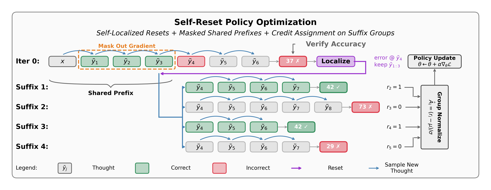
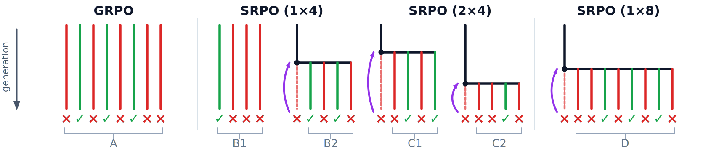
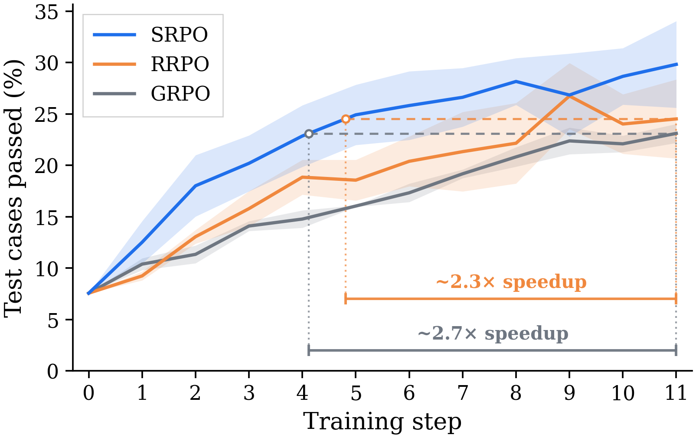
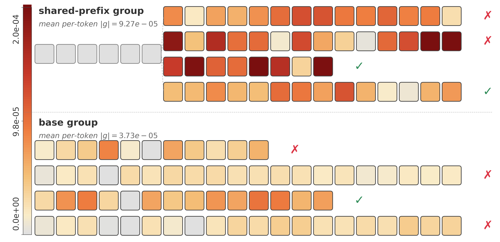
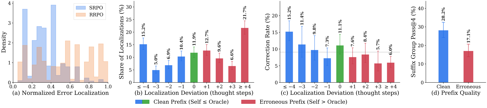

# SRPO: Credit Assignment with Resets in Language Model Reasoning

[](https://arxiv.org/abs/2605.25507)
[](LICENSE)

📄 **Paper:** [arXiv:2605.25507](https://arxiv.org/abs/2605.25507)

**Self-Reset Policy Optimization (SRPO)** — an RL method that improves credit assignment in
language-model reasoning by *resetting* to an intermediate reasoning state and resampling
counterfactual continuations from there, so that outcome differences are attributed to the
decision made at that state rather than smeared uniformly across the whole trajectory.

> **TL;DR.** RLVR propagates a single outcome reward uniformly across every token of a reasoning
> trace, punishing correct steps alongside the one that caused failure. We re-enter an intermediate
> state and resample from it: **SRPO** self-localizes the first erroneous step and resets there;
> **RRPO** resets at a random step. Across models and reasoning benchmarks, SRPO beats standard GRPO
> and RRPO — with no external step-level supervision.

This repository contains the SRPO/RRPO training methods, the GRPO and self-correction baselines,
and the evaluation harness.

---

## The idea

Reinforcement learning with verifiable rewards (RLVR) assigns one outcome reward to an entire
multi-step trajectory, regardless of which steps actually contributed to success or failure. That
is a **credit-assignment** problem: the update can't tell a load-bearing reasoning step from an
incidental one.

**Resets** are a simple fix. Re-enter an intermediate state and resample several continuations from
it; differences in their outcomes bind credit to the decision made *at that state*. We study two
ways to choose the reset point:

- **RRPO (Random-Reset Policy Optimization)** — reset at a randomly chosen reasoning step.
- **SRPO (Self-Reset Policy Optimization)** — the model self-localizes the *first erroneous step* in
  a failed trajectory and resets there.

We analyze both within **Conservative Policy Iteration (CPI)**, extending it with a
**credit-assignment oracle** that targets *improvable states* (those admitting an action with
strictly positive advantage). Oracle-guided resets improve sample complexity by a factor of
$1/p_\pi^2$ over random resets, where $p_\pi$ is the on-policy coverage of improvable states — and
SRPO realizes that gain in practice using only the model itself.

### Self-Reset Policy Optimization

<p align="center"></p>

The base policy produces an initial rollout (Iter 0) that fails. The model self-localizes the first
erroneous thought ($\tilde{y}_4$) and **resets to the improvable prefix** $\tilde{y}_{1:3}$. From
this shared prefix, multiple suffix rollouts are sampled, each receiving a reward $r_i$. Group
normalization converts rewards to advantages $\hat{A}_i$ that drive the policy update; **the gradient
on the shared prefix is masked out**, so learning concentrates on the suffix tokens — the steps
*following* the first error, rather than re-deriving the correct prefix from scratch.

Reasoning is generated **thought-by-thought**: a Thought MDP keeps the same policy but makes each
action a complete reasoning step (a "thought", delimited by `</thought>`), with the terminal answer
in `\boxed{}`. These principled boundaries are what make self-localization and resetting tractable.

### Reset-based sampling strategies

<p align="center"></p>

Under a fixed 8-rollout-per-prompt budget, SRPO/RRPO split rollouts into a base group (fresh i.i.d.
samples) and a reset group (suffix continuations from the reset state), so the two groups share a
common prefix and differ only after the reset point.

---

## Results

We train **OLMo-3-7B-Instruct** and **Qwen-2.5-14B-Instruct** on math (NuminaMath Olympiads) and
code (LiveCodeBench v6 medium) reasoning, and compare against **GRPO**, **RRPO**, and the
self-correction / segment-level baselines **SCoRe**, **Critique-GRPO**, and **SPO-Tree**.

### SRPO converges higher and faster

<p align="center">


</p>

*Left:* SRPO converges to a higher pass rate and reaches matching pass rates **2–3× faster** than
GRPO and RRPO (RRPO tracks GRPO). Validation on LiveCodeBench v6 medium, OLMo-3-7B; bands are ±1 SE.
*Right:* per-thought mean of the per-token gradient signal under one SRPO update (1×4 split) — 4
shared-prefix corrections (top, with the masked prefix) and 4 base-group rollouts (bottom),
showing where each loss assigns credit across a rollout's tokens (gray = masked, no gradient).

### Self-localization is precise, and precision is what makes resets pay off

<p align="center"></p>

Self-localization dynamics of OLMo-3-7B on LiveCodeBench v6 medium (≈17 thoughts per sequence):
**(a)** self-localized vs. random reset distribution; **(b)** self-localization vs. frontier-model
localization; **(c)** correction rate by deviation from the oracle (Wilson 95% CIs); **(d)** Pass@4
correction rate for clean vs. erroneous prefixes. Resampling from a **clean prefix** corrects far
more often than from an erroneous one — precise localization is what makes the correction land.

> The figures rendered here, plus the gradient-signal trajectory and additional ablations, are in
> [`figures/`](figures/); the scripts that produce them live in [`scripts/`](scripts/).

**Takeaway.** Treating resets as a training-time credit-assignment mechanism — and choosing the
reset point by self-localizing the first error — lets a model assign its own step-level credit from
the relative separation of suffix rollouts, with no external supervision.

---

## Repository structure

```
training/             # SRPO / RRPO / GRPO training (built on verl)
├── srpo_agent_loop.py        # SRPO & RRPO: reset + multi-suffix sampling (two-group rollout)
├── srpo_loss.py               # reset policy-optimization loss (prefix-masked, group-normalized)
├── srpo_clip_loss.py              # clip-ablation loss
├── thought_agent_loop.py      # GRPO baseline (thought-by-thought generation, vanilla loss)
├── thought_ics_agent_loop.py  # thought-level ICS sampling + self-localization
├── config/                    # hydra agent-loop configs
└── scripts/                   # training launchers + prepare_datasets.py

baselines/                     # SCoRe, Critique-GRPO, SPO-Tree
thought_ics/                   # iterative self-correction: generation, localization, verification
evaluation/                    # eval harness, thought-MDP, data utils
vendor/                        # vendored dataset loaders + 3rd-party localization helpers
scripts/                       # plotting + analysis (the figures behind the paper)
batch_scripts/                 # SLURM submit scripts (training + evaluation)
figures/                       # paper figures
tests/                         # unit tests
```

---

## Installation

Requires **Python 3.12** and CUDA GPUs (training uses [verl](https://github.com/volcengine/verl) +
vLLM). `requirements.txt` is a full freeze of the tested environment (torch 2.9, vLLM 0.11.2,
transformers 4.57, verl pinned to a specific commit).

```bash
conda create -n srpo python=3.12
conda activate srpo
pip install -r requirements.txt
```

`environment.yml` is provided only to provision the Python version and an isolated conda env —
libraries still install through pip:

```bash
conda env create -f environment.yml   # creates the 'srpo' env (Python 3.12 + pip)
conda activate srpo
pip install -r requirements.txt
```

---

## Usage

Training and evaluation are driven by SLURM submit scripts in `batch_scripts/` (each accepts
`--local` to run on the current node instead of submitting). Models: `olmo7b`
(OLMo-3-7B-Instruct), `qwen14b` (Qwen-2.5-14B-Instruct).

**Prepare data** (writes train/test parquet splits under `~/data/rlhf/`):

```bash
python training/scripts/prepare_datasets.py --datasets numinamath_olympiads livecodebench_medium
```

**SRPO / RRPO** (the paper methods) — two-group rollout with reset + multi-suffix sampling:

```bash
# SRPO: self-localized reset (NuminaMath Olympiads)
bash batch_scripts/submit_srpo.sh olmo7b_numina_oly_l2new
# RRPO: random reset
bash batch_scripts/submit_srpo.sh olmo7b_numina_oly_rand
# code (LiveCodeBench v6 medium); append _s0 / _s420 for seed variants
bash batch_scripts/submit_srpo.sh olmo7b_lcb_medium_l2new
```

**GRPO baseline** (thought-by-thought generation, standard outcome-reward GRPO):

```bash
bash batch_scripts/submit_thought_grpo.sh olmo7b_numina_oly
```

**Other baselines:**

```bash
bash batch_scripts/submit_score.sh         olmo7b_numina_oly_tree   # SCoRe
bash batch_scripts/submit_critique_grpo.sh olmo7b_numina_oly        # Critique-GRPO
bash batch_scripts/submit_spo.sh           olmo7b_numina_oly_tree   # SPO-Tree
```

**Evaluation** across the benchmark suite:

```bash
bash batch_scripts/submit_eval_baselines.sh <model_key>
```

Run any submit script with no arguments to print its available jobs.

> **Note:** this is a code release. Trained checkpoints and raw run artifacts are not shipped; the
> commands above regenerate them.

---

## Citation

```bibtex
@misc{samanta2026credit,
      title={Credit Assignment with Resets in Language Model Reasoning},
      author={Ankur Samanta and Akshayaa Magesh and Ayush Jain and Youliang Yu and Daniel Jiang and Kavosh Asadi and Kaveh Hassani and Paul Sajda and Jalaj Bhandari and Yonathan Efroni},
      year={2026},
      eprint={2605.25507},
      archivePrefix={arXiv},
      primaryClass={cs.LG},
      url={https://arxiv.org/abs/2605.25507},
}
```

## License

Released under the [MIT License](LICENSE).
